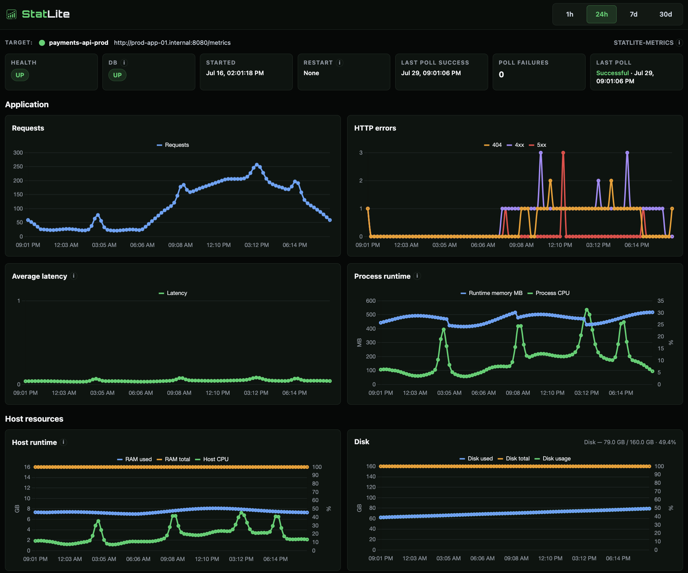

# StatLite

A tiny metrics dashboard for one-person and small-team self-hosted
applications.

StatLite supports Spring Boot Actuator and StatLite Metrics applications. It
stores focused health, traffic, latency, CPU, memory, and optional host metrics
in local SQLite without requiring Prometheus or Grafana.

**StatLite is not a Prometheus/Grafana replacement.**



Learn how to set up [lightweight Spring Boot monitoring without Prometheus and Grafana](https://pvrlabs.xyz/articles/lightweight-spring-boot-monitoring.html).

## Quick Start

### Docker

```bash
docker run --rm \
  -p 127.0.0.1:9090:9090 \
  ghcr.io/pvrlabs/statlite:latest
```

Open <http://127.0.0.1:9090>. The default container monitors StatLite itself.

See [Docker](docs/docker.md) for local builds, storage, access guidance, and
application examples.

### Build from source

```bash
go build -o statlite ./cmd/statlite
./statlite
```

Open <http://127.0.0.1:9090>. StatLite loads `statlite.yaml` from the current
directory and monitors itself through `/statlite/metrics`.

Edit `statlite.yaml` for the default single-target setup, or start from
`examples/multi-target.yaml` for multiple targets in one instance.

See `examples/` for configuration templates and runnable demo applications:

| Path | Description |
|------|-------------|
| `examples/multi-target.yaml` | Generic multi-target starter |
| `examples/actuator.yaml` | Spring Boot Actuator target |
| `examples/statlite.yaml` | StatLite self-monitoring target |
| `examples/spring-actuator-demo/` | Standalone Spring Boot demo application |
| `examples/python-fastapi-demo/` | Runnable FastAPI application exposing StatLite Metrics v1 |

### Installed binary

If StatLite is already on your `PATH` through a release installer or Homebrew:

```bash
cp examples/actuator.yaml ./statlite.yaml   # or create your own config
# edit credentials and URLs
statlite --config ./statlite.yaml
```

The default config path is `statlite.yaml` in the current working directory.

## Supported integrations

- `spring`: Spring Boot Actuator
- `statlite-metrics`: fixed `statlite-metrics/v1` JSON profile
- StatLite self-monitoring through its own `/statlite/metrics` endpoint

See [StatLite Metrics v1](docs/statlite-metrics-v1.md) for the application
producer contract.

See [Product and architecture](docs/product.md) for StatLite’s scope, design
principles, and normalized collection model.

## Config

`statlite.yaml` is loaded by default. For production, point it at your app:

```bash
./statlite --config examples/actuator.yaml
```

Prefer environment variables for Actuator credentials:

```yaml
auth:
  type: "basic"
  username: "${STATLITE_ACTUATOR_USERNAME}"
  password: "${STATLITE_ACTUATOR_PASSWORD}"
```

StatLite expands `$VAR` and `${VAR}` across the config once at startup.
Plaintext credentials remain supported, but restrict that config file with
`chmod 600` on a server. Credentials are never rendered in the dashboard or
API responses. See [configuration](docs/configuration.md) for config fields,
escaping literal `${` syntax, and other details.

## Deployment

The binary is self-contained. See [Installation](docs/install.md) and
[systemd deployment](docs/systemd.md) for installation and server provisioning.
Installers and package managers install only the binary. They do not create
config files, initialize storage, install units, or start services.

### Dashboard access

StatLite does not include built-in dashboard or API authentication.

By default, examples bind the server to `127.0.0.1:9090`, so the dashboard is
reachable only from the local machine. For remote access, use an SSH tunnel,
VPN, firewall-restricted private network, or an authenticated reverse proxy.

You may bind to `0.0.0.0:9090` when access is protected externally. Without
external protection, anyone who can reach the port can view dashboard and API
data such as target names and operational metrics.

## Version and health

```bash
statlite --version
```

`GET /healthz` returns JSON including the same version string.

Process health semantics:

- Top-level `status` and the HTTP status code describe **StatLite itself**, not whether monitored targets are healthy.
- Monitored-target poll failures do **not** mark the process unhealthy.
- If the local SQLite store fails its health check, `/healthz` reports `status: "error"` and HTTP 503.

## API stability

`/api/*` is early and internal, and is not yet a stable public API. Fields and
routes may change without a compatibility guarantee.

Missing optional metrics may appear as `null` or be omitted from charts. They
should degrade cleanly rather than failing the whole dashboard.

## Current limitations

StatLite is early and intentionally limited:

- **Raw samples only:** no derived rollups or downsampling. Query-time delta computation is used for counters.
- **No alerts:** dashboard only. No alert manager or notifications.
- **No dashboard auth:** see [Dashboard access](#dashboard-access) for safe deployment options.
- **Focused integrations:** arbitrary metric endpoints, Prometheus/OpenMetrics, labels, and custom dashboards are not supported in the MVP.
- **Credential handling:** use environment variables where possible. Plaintext YAML credentials remain supported and should be restricted with `chmod 600`.
- **Dashboard CDN assets:** Chart.js and fonts may load from external CDNs. The backend is a single binary, but full dashboard rendering still depends on those external frontend assets for now.

## License

MIT
